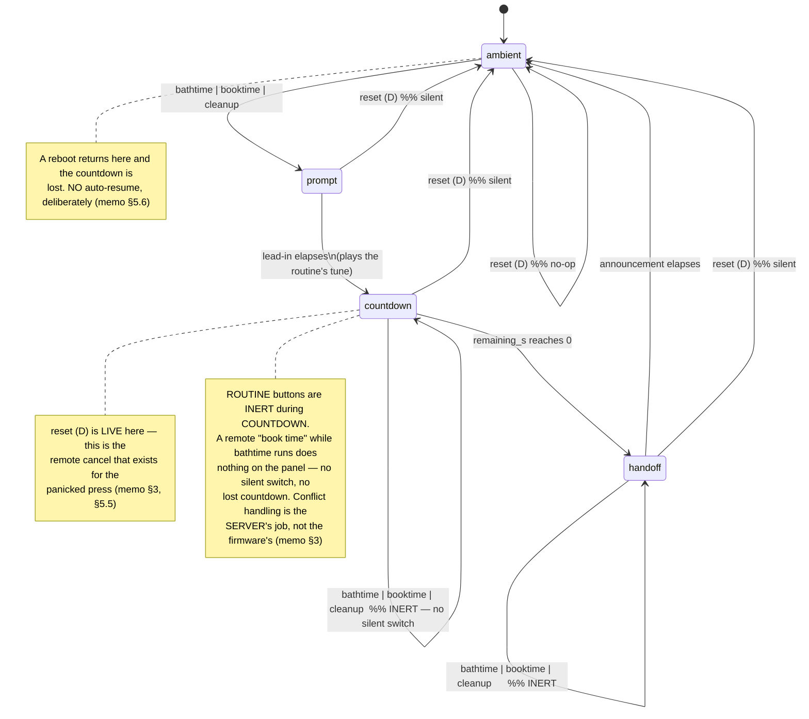

# State machine — desired state applied to the panel

Two state diagrams. The first is the **panel's own** state machine as this contract must respect it
(it is ground truth, and unchanged by this project — memo §3). The second is the **server's view of a
command's life**, which is what the UI must render (memo §9.1).

## 1. The panel's states, and which event is live in each

The panel's states come from v1.5; **the remote does not change them**. The remote only supplies the
same four events the buttons supply (memo §3).

### Consequences for the server

- The server cannot switch routines by sending `start Y` while X counts down — the panel will ignore
  it. Hence the server-side **cancel → wait → start** sequence (see
  `replace-conflict-sequence.md`).
- The server must not treat "no observable change" as a bug: an inert button press is correct panel
  behaviour.
- `reset` is always safe to send; the panel decides whether it is a cancel or a no-op.

## 2. The server's view of a command's life (the "sent vs done" rule)

```mermaid
stateDiagram-v2
    [*] --> idle
    idle --> refused: panel offline\n(refuse BEFORE setting — memo §5.5)
    idle --> conflict: different routine counting down\n(offer replace; set NOTHING)
    idle --> noop: already running X, or cancel from ambient
    idle --> sending: resolveCommand -> 'set'\ngen++ ; desired written

    sending --> confirmed: poll reports applied_gen >= gen\n(the panel DID it)
    sending --> expired: TTL (~45 s) elapsed, applied_gen never advanced\n(drop desired — never queue)
    sending --> shadowed: a newer command supersedes this gen
    sending --> sending: poll reports applied_gen < gen\n(cadence 2000 ms)

    confirmed --> idle: acknowledged in the UI, logged 'applied'
    expired --> idle: UI says "the panel didn't answer (last seen 3m ago)", logged 'expired'
    refused --> idle: UI disabled / loudly caveated while offline
    conflict --> idle: logged 'conflict'
    noop --> idle: logged 'noop'
    shadowed --> idle: logged 'shadowed'

    note right of sending
      The UI shows "sending…" here.
      NOT a happy toast (memo §9.1)
    end note
```

### The rule, stated plainly (memo §9.1)

> A command can be accepted by the server and never reach the panel. Under a naive design the phone
> shows a happy toast, the panel does nothing, and two people conclude the *panel* is broken — the
> worst possible diagnosis, aimed at the one device that is hardest to debug.

Therefore:

- **Panel liveness is shown continuously** ("panel: last seen 2 s ago"), from the free poll-derived
  heartbeat.
- A press goes **sending… → confirmed**, and only confirms when the device reports the new
  `applied_gen`.
- If it does not land inside the TTL: **"the panel didn't answer (last seen 3m ago)"**, plainly.
- The UI is **disabled** (or loudly caveated) when the panel is offline, rather than accepting a
  command that will expire.
- The outcome is **logged either way**, so "it didn't work" becomes a record rather than an argument.
- The panel's failure to answer may be a **heap** problem, not a network one, so the log records
  *what the poll last reported* and *when* (memo §9.1, §11.15).

## 3. Transitions that must never exist

| Never | Why |
|---|---|
| `expired → sending` (fire a late command) | A lead-in started four minutes late says something false to a three-year-old (memo §5.4). |
| `sending → confirmed` on anything but `applied_gen` | A server-side "accepted" is not the panel doing it (memo §9.1). |
| `desired` re-applied after a new `boot` id | Auto-resume after a reboot is worse than a quietly-ended countdown (memo §5.6). |
| A routine switch without an explicit `conflict → replace` step | "Never a silent switch" (memo §5.5). |
