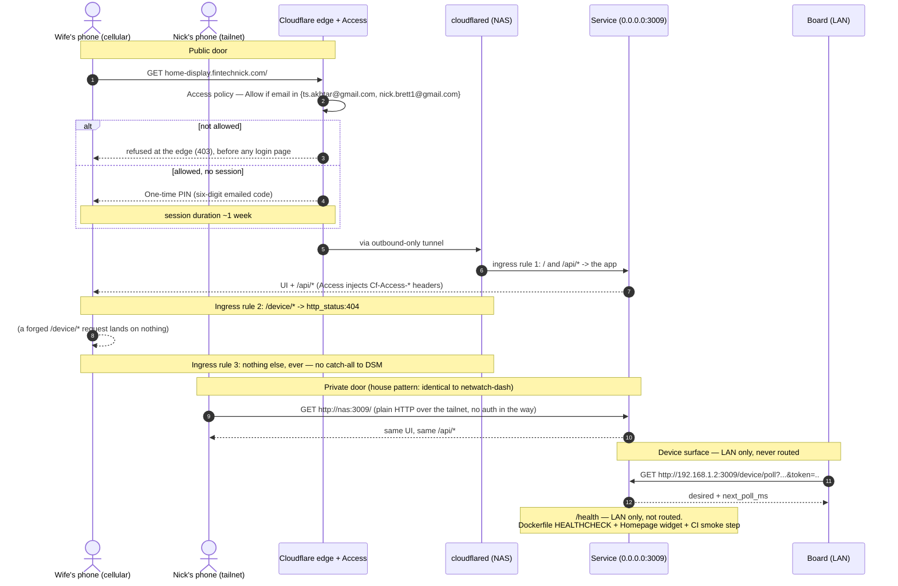

# Flow — the two doors, and which surface can see what

Source: memo §7.4, §8, §8.3, §8.4, §9.4, §10. This is the flow the security model rests on: the
surfaces are split by **policy and routing**, not by interface (memo §7.1).

## 1. Routing

## 2. The three ingress rules, verbatim (memo §8.4)

1. `/` and `/api/*` → the app.
2. **`/device/*` → `http_status:404`.** The device path is not merely unauthenticated-and-hidden; it
   is structurally absent from the public surface. Cheap to write, impossible to forget later.
3. **Nothing else. Ever.** A tunnel whose catch-all points at DSM would put the NAS admin UI behind
   Access — not a catastrophe, but not the goal, and a genuinely easy mistake with
   `network_mode: host`. *A NAS-admin login page reachable from the internet is the failure mode of
   this entire section.*

`/health` is deliberately **not** routed either — the ingress routes only `/` and `/api/*`.

## 3. The identity header, and the trap in it (memo §8.3)

Access injects `Cf-Access-Authenticated-User-Email` and `Cf-Access-Jwt-Assertion`. Treat them as:

- **For display and audit** ("signed in as …") the email header is fine.
- **Never as an authorisation input unless the JWT is also verified** against Cloudflare's Access
  certs — because the same app is reachable on the LAN and the tailnet, where nothing strips a forged
  header.

The right answer is to have **no privilege tiers at all** — and since duration editing is out of
scope, there is nowhere for the trap to hide (memo §8.3, §10). The concrete predicate by which the
app knows a request came from the tunnel vs the tailnet is a formalisation left **open**
(description.md §6.4); the design constraint is only that it must not *grant* anything on the
strength of the header alone.

## 4. Why loopback was not an option

The house pshelf convention binds `127.0.0.1:3005:3000` because only the tunnel/tailnet need it.
**This service cannot be loopback-only**, because a Pico W on the LAN is a real client with no
Tailscale. So it publishes on the LAN and splits the surfaces by policy and routing instead of by
interface (memo §7.1; stack-memo §4). See `docs/adr/0003-lan-bind-0.0.0.0-3009.md`.

## 5. What Cloudflare in the path does not solve (memo §8.2)

- If Cloudflare is down, the public door is shut. Nick's tailnet door is not. Acceptable, and worth
  knowing rather than discovering.
- Access is not a substitute for the app being harmless: the app still should not be able to do
  anything except start and cancel — which the scope decision makes literally true (memo §10).

## 6. iOS specifics (memo §8.5)

Access sessions are cookies, and a home-screen web-app on iOS is not always the same storage as
Safari. **Verify the session survives in the PWA** in Phase A; if it does not, a Safari bookmark is
the fallback. A spouse who has to re-auth every time will stop using this.
