# State machine — the panel's lifecycle as seen by the server

Liveness is free: **"last seen Ns ago" *is* the poll** (memo §4). This diagram is the server's model
of the panel across boots and network windows, plus the two guards that make a reboot safe.

## 1. Lifecycle

```mermaid
stateDiagram-v2
    [*] --> unseen: service starts\n(no poll yet)
    unseen --> online: first /device/poll\n(seed gen = applied_gen + 1)
    offline --> online: a poll arrives again\n(after a DHCP/heap window)
    online --> offline: no poll within the offline threshold\n(threshold is an OPEN DECISION)
    online --> rebooted: poll reports a NEW boot id
    rebooted --> online: same poll is processed normally
    offline --> rebooted: panel rebooted unseen;\nfirst poll back carries a new boot id

    note right of unseen
      gen is seeded from the board's reported
      applied_gen + 1 so the server can never sit
      below the board's high-water mark (memo §5.1)
    end note
    note right of online
      next_poll_ms inputs:
        desired gen > applied_gen  -> 2000
        state in {countdown, handoff} -> 2000
        live SSE subscribers > 0  -> 2000
        otherwise                 -> 5000
    end note
    note right of rebooted
      On a NEW boot id the server CLEARS pending desired
      before computing this poll's response (memo §5.6),
      audits the change, and never re-runs the last command.
      applied_gen persisted on the board is the second guard.
    end note
    note right of offline
      The UI disables / loudly caveats commands while offline,
      and the server refuses before setting anything (memo §5.5, §9.1).
    end note
```

## 2. What each transition costs, and who recovers it

| Transition | Trigger | Server action | UI |
|---|---|---|---|
| `unseen → online` | first poll | seed `gen = reported applied_gen + 1`; audit | "panel: last seen 0 s ago" |
| `online → offline` | no poll past the threshold | nothing to set; commands refused | controls disabled / caveated |
| `offline → online` | poll arrives | re-seed nothing; just resume | controls enabled |
| `online → rebooted` | new `boot` id | **clear pending desired**, log boot-id change | mirror snaps to AMBIENT (no auto-resume) |
| `rebooted → online` | same poll | process normally | — |

## 3. The two reboot guards (memo §5.6)

The *opposite* failure — the panel rebooting and immediately re-running the last command — is made
impossible by **two independent guards**:

1. The **server clears pending desired** the moment it sees a new `boot` id.
2. **`applied_gen` is persisted on the board's flash**, so the board ignores a `gen` it has already
   applied even if the server forgot.

And the intended failure is kept: **no auto-resume**. A countdown that reappears after the child has
moved on is worse than one that quietly ended.

## 4. Side effect: this is informally the panel's health monitor

The server logs boot-id changes and derives liveness from the poll, so it already holds the panel's
health data (memo §5.6, §11.5). Surfacing it properly (panel-health history) is a **later, cheap
addition rather than a design question** — the data is already there. The audit log records boot
changes as `action='boot'` rows (`audit-log-schema.sql`).

## 5. Open decisions touched

- **Offline threshold** — the cut-off behind `online` (description.md §6.4).
- **Audit retention** — how long boot/window churn is kept (description.md §6.4).
